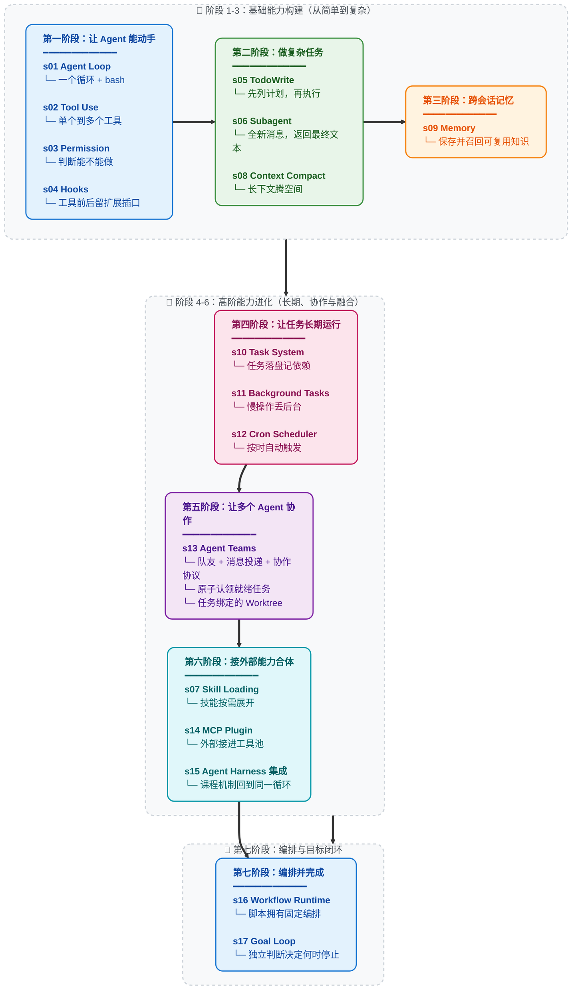

GitHub上一个以Claude code为例子的agent/harness原理[教程](https://github.com/shareAI-lab/learn-claude-code)

## 前言
agent = model + harness
### Agency
agency是感知、推理、行动的能力，llm的agency是训练出来的，不是编写出来的。
**提示词水管工式 "Agent" 是不做模型的程序员的意淫。**
### 从开发agent到开发harness
开发agent一方面是开发model，另一方面是开发harness
### harness工程师在做什么
实现工具、策划知识、管理上下文、控制权限、收集执行过程数据
### Claude code的构成
```
Claude Code = 一个 agent loop
            + 工具 (bash, read, write, edit, glob, grep, browser...)
            + 按需 skill 加载
            + 上下文压缩
            + 子 agent 派生
            + 带依赖图的任务系统
            + 异步邮箱的团队协调
            + 任务绑定的 worktree 并行执行
            + 权限治理
```

### 一个agent loop
```python
def agent_loop(messages):
    while True:
        response = client.messages.create(
            model=MODEL, system=SYSTEM,
            messages=messages, tools=TOOLS,
        )
        messages.append({"role": "assistant",
                         "content": response.content})

        tool_calls = [
            block for block in response.content if block.type == "tool_use"
        ]
        if not tool_calls:
            return

        results = []
        for block in tool_calls:
            output = TOOL_HANDLERS[block.name](**block.input)
            results.append({
                "type": "tool_result",
                "tool_use_id": block.id,
                "content": output,
            })
        messages.append({"role": "user", "content": results})
```

```
                    THE AGENT PATTERN
                    =================

    User --> messages[] --> LLM --> response
                                      |
                              包含 tool_use block?
                           /                          \
                         yes                           no
                          |                             |
                    execute tools                    return text
                    append results
                    loop back -----------------> messages[]


    这是最小循环。每个 AI Agent 都需要这个循环。
    模型决定何时调用工具、何时停止。
    代码只是执行模型的要求。
    本仓库教你构建围绕这个循环的一切 --
    让 agent 在特定领域高效工作的 harness。
```

### 学习路线
能动手、能做复杂任务、能记住和恢复、能长期运行、能协作、能扩展并合体



## S01-Agent loop

> One loop & bash is all you need

传统chat的问题：大模型输出完了就结束了，不会自己调试。
解决方案：引入agent loop，harness内核本质是一个循环

![[1-learn-claude-code-1787210447380.webp]]

## s02-Tool Use

![[1-learn-claude-code-1787210921245.webp]]

## s03-Permissiong

![[1-learn-claude-code-1787211237210.webp]]

## s04-Hooks

想扩展agent的行为，又不改变循环本身，把扩展挂在外面

![[1-learn-claude-code-1787211830207.webp]]

## s05-TodoWrite

问题：注意力稀释
（🤔：需要这些工具的原因是model的context不够用，如果够用的话这些工具其实不是必要的，但是会不会有了这些工具之后，一个强大的模型会变的更强大，还是会被拖累，拭目以待。

![[1-learn-claude-code-1787213941001.webp]]

todo_write本质上是一个tool

## s06-Subagent
新的问题：如果一个任务太大，todo列表也不够，那就需要subagent

> Subagents give each subtask a clean message history while preserving the main thread.

![[1-learn-claude-code-1787214555035.webp]]

父agent和子agent共享workdir
只有一层委派

## s07-Skills
一方面，也是因为上下文的问题，不同的任务需要不同的知识；另一方面一个重复的流程完全可以封装成一个skill进行复用

![[1-learn-claude-code-1787223157974.webp]]

## s08-Context Compact
上下文总是会满，压缩让有限的上下文持续服务于长任务

![[1-learn-claude-code-1787223360175.webp]]

压缩管线设计

![[1-learn-claude-code-1787223548686.webp]]

### 第一步：tool_result_budget
工具返回结果预算

![[1-learn-claude-code-1787223665000.webp]]

### 第二步：snip_compact
用于控制消息数量
先把完整历史写入`.transcripst/`，再保留头尾，中间明确标记会写明删去了多少消息，以及完整记录在哪里

### 第三步：micro_compact

![[1-learn-claude-code-1787224048543.webp]]

前面读过的后面就不用读了

### 第四步：compact_history

![[1-learn-claude-code-1787224469677.webp]]

## s09-Memory

> Some facts should survive summarization and future sessions

Memory要解决的问题：哪些信息值得跨对话保存，当前任务应该回取哪几条。


![[1-learn-claude-code-1787225421888.webp]]

### 全部写入，不合适
可能会引入很多无关紧要的东西。一种更合适的方式：保留剪短的索引，只在需要时加载正文。
需要处理的四件事情：存储、召回、提取和整理

![[1-learn-claude-code-1787225545632.webp]]

### 存储：一个记忆一个文件
