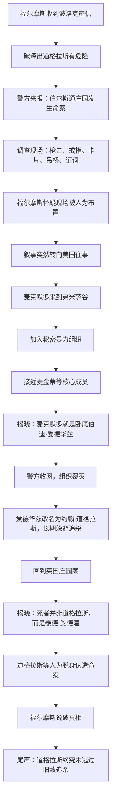
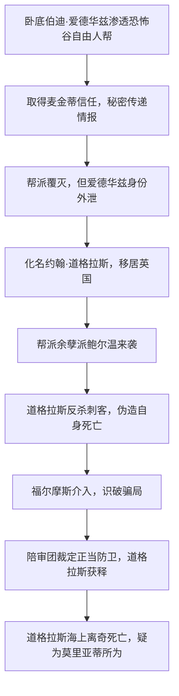
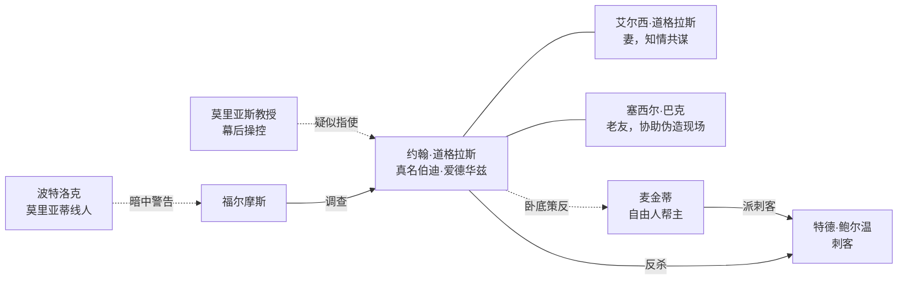
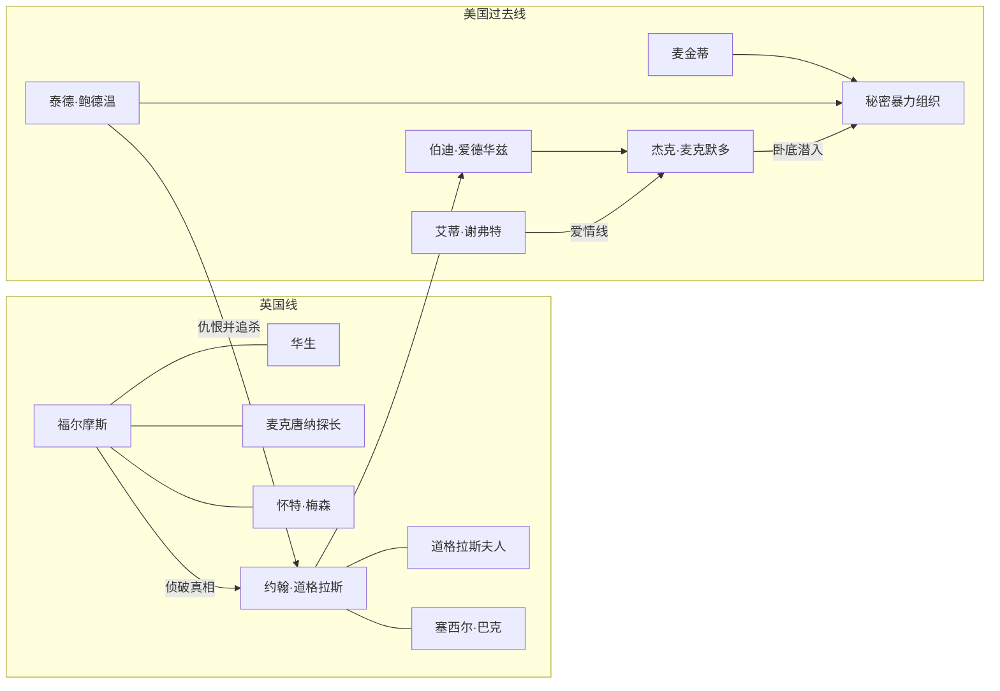
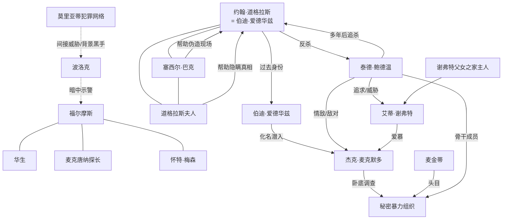

# 叙事流程

```mermaid
flowchart TD
    A[福尔摩斯收到波洛克密信] --> B[破译出道格拉斯有危险]
    B --> C[警方来报：伯尔斯通庄园发生命案]
    C --> D[调查现场：枪击、戒指、卡片、吊桥、证词]
    D --> E[福尔摩斯怀疑现场被人为布置]
    E --> F[叙事突然转向美国往事]
    F --> G[麦克默多来到弗米萨谷]
    G --> H[加入秘密暴力组织]
    H --> I[接近麦金蒂等核心成员]
    I --> J[揭晓：麦克默多就是卧底伯迪·爱德华兹]
    J --> K[警方收网，组织覆灭]
    K --> L[爱德华兹改名为约翰·道格拉斯，长期躲避追杀]
    L --> M[回到英国庄园案]
    M --> N[揭晓：死者并非道格拉斯，而是泰德·鲍德温]
    N --> O[道格拉斯等人为脱身伪造命案]
    O --> P[福尔摩斯说破真相]
    P --> Q[尾声：道格拉斯终究未逃过旧敌追杀]
```

# 故事发展流程

```mermaid
flowchart TD
    A[卧底伯迪·爱德华兹渗透恐怖谷自由人帮] --> B[取得麦金蒂信任，秘密传递情报]
    B --> C[帮派覆灭，但爱德华兹身份外泄]
    C --> D[化名约翰·道格拉斯，移居英国]
    D --> E[帮派余孽派鲍尔温来袭]
    E --> F[道格拉斯反杀刺客，伪造自身死亡]
    F --> G[福尔摩斯介入，识破骗局]
    G --> H[陪审团裁定正当防卫，道格拉斯获释]
    H --> I[道格拉斯海上离奇死亡，疑为莫里亚蒂所为]
```
# 人物关系

```mermaid
graph LR
    M[莫里亚斯教授\n幕后操控] -.->|疑似指使| D
    P[波特洛克\n莫里亚蒂线人] -.->|暗中警告| H
    H[福尔摩斯] -->|调查| D
    D[约翰·道格拉斯\n真名伯迪·爱德华兹] --- E[艾尔西·道格拉斯\n妻，知情共谋]
    D --- CB[塞西尔·巴克\n老友，协助伪造现场]
    MG[麦金蒂\n自由人帮主] -->|派刺客| B[特德·鲍尔温\n刺客]
    D -->|反杀| B
    D -.->|卧底策反| MG
```

```mermaid
graph LR
    subgraph 英国线
        H[福尔摩斯]
        W[华生]
        M[麦克唐纳探长]
        WM[怀特·梅森]
        D[约翰·道格拉斯]
        WD[道格拉斯夫人]
        B[塞西尔·巴克]
    end

    subgraph 美国过去线
        E[伯迪·爱德华兹]
        JM[杰克·麦克默多]
        MG[麦金蒂]
        TB[泰德·鲍德温]
        ET[艾蒂·谢弗特]
        SS[秘密暴力组织]
    end

    E --> JM
    D --> E
    MG --> SS
    TB --> SS
    JM -->|卧底潜入| SS
    TB -->|仇恨并追杀| D
    D --- WD
    D --- B
    H --- W
    H --- M
    H --- WM
    H -->|侦破真相| D
    ET -->|爱情线| JM
```

```mermaid
graph TD
    Holmes[福尔摩斯] --- Watson[华生]
    Holmes --- MacDonald[麦克唐纳探长]
    Holmes --- Mason[怀特·梅森]

    Douglas[约翰·道格拉斯\n= 伯迪·爱德华兹] --- Wife[道格拉斯夫人]
    Douglas --- Barker[塞西尔·巴克]
    Barker --- Wife

    Porlock[波洛克] -.暗中示警.-> Holmes
    Moriarty[莫里亚蒂犯罪网络] -.间接威胁/背景黑手.-> Porlock

    Douglas -->|过去身份| Edwards[伯迪·爱德华兹]
    Edwards -->|化名潜入| McMurdo[杰克·麦克默多]

    McMurdo -->|卧底调查| Scowrers[秘密暴力组织]
    McGinty[麦金蒂] -->|头目| Scowrers
    Baldwin[泰德·鲍德温] -->|骨干成员| Scowrers

    Baldwin -->|情敌/敌对| McMurdo
    Ettie[艾蒂·谢弗特] -->|爱慕| McMurdo
    Baldwin -->|追求/威胁| Ettie
    Shafter[谢弗特父女之家主人] --> Ettie

    Baldwin -->|多年后追杀| Douglas
    Douglas -->|反杀| Baldwin

    Barker -->|帮助伪造现场| Douglas
    Wife -->|帮助隐瞒真相| Douglas
```
